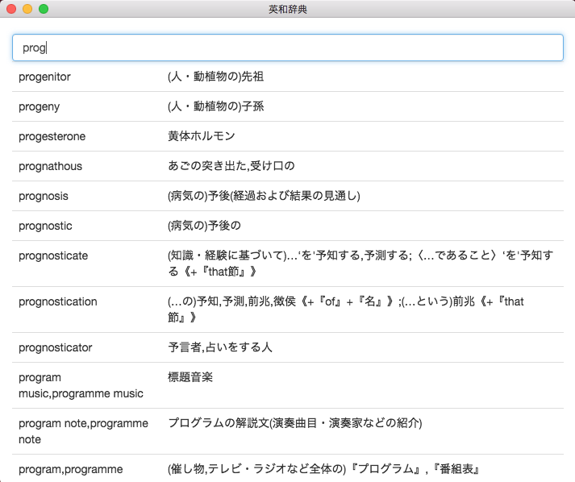

# ejjedict

英和和英辞典

- 英和辞典は [EJDict](https://github.com/kujirahand/EJDict)、
  和英辞典は [EDICT2](http://www.edrdg.org/jmdict/edict.html) （いずれも無料の辞書）を使用しています
- ネットが繋がっていなくても使用可能です

## Download

- [OS X](https://github.com/tex2e/ejjedict/blob/master/ejjedict-darwin-x64.zip?raw=true) - 10.9 or later is required
- [Windows 32 bit](https://github.com/tex2e/ejjedict/blob/master/ejjedict-win32-x64.zip?raw=true) - Windows 7 and later are supported
- [Ubuntu](https://github.com/tex2e/ejjedict/blob/master/ejjedict-linux-x64.zip?raw=true) - Ubuntu 12.04 and later
